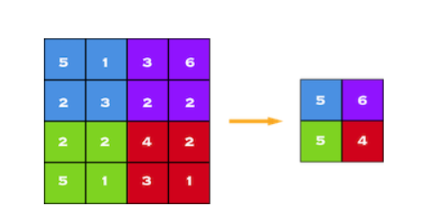

# Optidash-Challenge-OCR-for-hand-written-digits
- An implementation of an OCR for hand-written text  
- The algorithm takes a single file as input (JPEG, PDF) and returns all hand-written text (mostly digits) found and recognized on that input. 

"Note: Main goal for this challange is to make a Digit Recogonizer and I will be following the approach of using CNN and MLP model with some hyperparameter tunings to train the classifier. Training dataset for this part will be the MNIST dataset from the kaggle Digit Recogonizer Challange."

The presented code is a simple implementation of Convolutional Neural Network (CNN) for training a MNIST digit classifier.

CNN extracts the features of image and converts it into lower dimension without loosing its characteristics. 
The convolution layer and the pooling layer can be fine-tuned with respect to hyperparameters.

Input Layer - Input Layer in CNN should contain image data.Image data is represented by three dimensional matrix and needs reshaping into single column.

Convo Layer - Convo layer is sometimes called feature extractor layer because features of the image are get extracted within this layer. Result of the operation is single integer of the output volume. Convo layer also contains ReLU activation to make all negative value to zero.

Pooling Layer - Pooling layer is used to reduce the spatial volume of input image after convolution. It is used between two convolution layer. 

Framework used and Dependencies
- Tensorflow - Keras
- Numpy
- Scikitlearn
- Matplotlib

The pipeline consist of a Dataset acquisition and preprocessing which is coded in "training_data.py". After that "build_model.py" is used for the defining and compiling the classifier model. The sample of the datset image and the label associated to it.

The main program for the execution is "train_classifier.py" or "train_classifier.ipynb" (you need to upload the dependent python files in the colab workspace for working with .ipynb). This program will generate and train the classification model which will be saved as classifier.h5. There is also a last part to the train_classifier which is giving the overview of the whole training process.

The summary of the model built can be seen below:

The learning curves obtained from the training on the dataset can be seen below.

The observations during the training process are:

The highest valued results during the training were obtained at Epoch 3 as I cancelled training my model after it has reached 98% accuracy with following specifications:

Training accuracy   - 0.9824 

Validation accuracy - 0.9903

Training Loss       - 0.0572

Validation Loss     - 0.0303

According to the theory and observation from the Learning rate graphs, we can comment that the optimum and satisfactory results for the model had been obtained. 

"NOTE:- Accuracy will reach more than 99.5% on futher epochs. In order to save time and resources we stopped training our model after it has reached 98% accuracy."

Now, for testing the trained Classifier we will be using the "test_classifier.py" or "test_classifier.ipynb" In this code the confusion matrix and the classification report were obtained for the trained model on the test dataset. The test dataset was also pre_processed. The following are the screenshots of these observations.

And following is the visual representation of of the Test dataset that is classified and It's original label and predicted lable.

